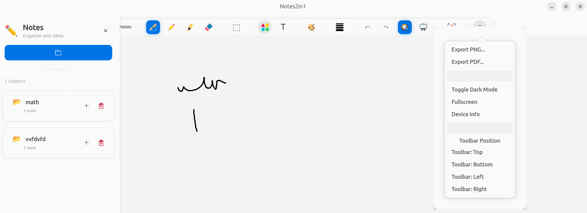
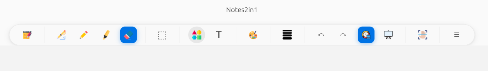

# Notes2in1

A comprehensive native Linux note-taking and drawing application optimized for 2-in-1/tablet devices with stylus support, featuring intelligent palm rejection, multiple input methods, and professional organization tools.

**Status**: ✅ Production Ready | **Version**: 1.3

## 🎯 Quick Overview

Notes2in1 is a full-featured note-taking app that combines:

- **Text Input**: Type notes with keyboard, formatting support
- **Handwriting**: Natural writing with stylus/pen
- **Drawing**: Shapes, colors, and artistic tools
- **Organization**: Subject-based library with multi-page notes
- **Smart Features**: Palm rejection, auto-save, templates

## 📸 Screenshots

### Full Application Interface


_Main interface showing the canvas, sidebar with note library, and complete toolbar_

### Toolbar Overview


_Comprehensive toolbar with drawing tools, shapes, colors, and formatting options_

## ✨ Features

| Category           | Features                                                                                                             |
| ------------------ | -------------------------------------------------------------------------------------------------------------------- |
| **Drawing Tools**  | Pen (pressure-sensitive) • Pencil (textured, tilt support) • Highlighter • Eraser • 25-color palette + custom colors |
| **Text Input**     | Full text editing • Bold/Italic/Underline • Adjustable size/color • Multi-line support                               |
| **Shapes**         | Line • Arrow • Rectangle • Circle • Triangle • Pentagon • Fill/Outline modes • Solid/Dashed/Dotted styles            |
| **Stylus Support** | Auto-detection • Smart palm rejection • Pressure sensitivity • Tilt support                                          |
| **Editing**        | Select • Move • Copy/Paste • Duplicate • Undo/Redo • Multi-object selection                                          |
| **Note Types**     | Canvas (infinite whiteboard) • A4 Notes (multi-page with templates)                                                  |
| **Templates**      | Blank • Ruled • Grid • Dot Grid                                                                                      |
| **Organization**   | Subject library • Create/Rename/Delete notes • Auto-save (30s) • Duplicate notes                                     |
| **Export**         | PNG • PDF (format-preserving)                                                                                        |
| **Interface**      | Dark mode • Fullscreen • Customizable toolbar position • Touch-optimized • Context menus                             |

## ⌨️ Keyboard Shortcuts

| Action             | Shortcut                       |
| ------------------ | ------------------------------ |
| **General**        |                                |
| New note           | `Ctrl+N`                       |
| Open file          | `Ctrl+O`                       |
| Save               | `Ctrl+S`                       |
| Save As            | `Ctrl+Shift+S`                 |
| Fullscreen         | `F11`                          |
| **Editing**        |                                |
| Undo/Redo          | `Ctrl+Z` / `Ctrl+Shift+Z`      |
| Select All         | `Ctrl+A`                       |
| Copy/Cut/Paste     | `Ctrl+C` / `Ctrl+X` / `Ctrl+V` |
| Duplicate          | `Ctrl+D`                       |
| Delete             | `Delete` or `Backspace`        |
| **Navigation**     |                                |
| Next/Previous page | `Page Down` / `Page Up`        |

## 🚀 Quick Start

1. Open or create a subject in the sidebar
2. Click "+ Note" → Choose **A4 Notes** (multi-page) or **Canvas** (infinite)
3. Select a template (for A4): Blank, Ruled, Grid, or Dot Grid
4. Start drawing, writing, or typing with the toolbar

### Template Guide

| Template | Best For                         |
| -------- | -------------------------------- |
| Blank    | Drawings, sketches               |
| Ruled    | Text notes, essays               |
| Grid     | Math, graphs, technical drawings |
| Dot Grid | Bullet journaling, planning      |

## 🔧 Setup for Palm Rejection

Palm rejection requires input device access:

```bash
sudo usermod -a -G input $USER
# Then logout and login
```

## 📦 Installation & Running

### For End Users (Recommended)

```bash
sudo snap install notes2in1
notes2in1
```

### For Developers

```bash
# Direct Python
python3 main.py

# Or with logging
./run_dev.sh
```

### For Testing Snap Package

```bash
./test_snap.sh  # Rebuilds and tests snap locally
```

### System Requirements (Development)

**Ubuntu 22.04+ with Python 3.11+**

```bash
sudo apt install python3 python3-pip libgtk-4-dev libadwaita-1-dev \
    libcairo2-dev libgirepository1.0-dev gir1.2-gtk-4.0 gir1.2-adw-1
```

### Publishing to Snap Store

```bash
# Setup (one-time)
sudo snap install snapcraft --classic
snapcraft login
snapcraft register notes2in1

# Build and publish
snapcraft
snapcraft upload notes2in1_*.snap
snapcraft release notes2in1 <revision> stable
```

## 📄 File Formats

- **Native**: `.n2i` (JSON-based, version-tracked)
- **Export**: PNG (raster) • PDF (A4-sized)

## 🔧 Troubleshooting

| Issue                          | Solution                                                             |
| ------------------------------ | -------------------------------------------------------------------- |
| **Palm rejection not working** | `sudo usermod -a -G input $USER` (logout/login required)             |
| **App won't start**            | Check logs: `tail -f logs/notes2in1_*.log` • Install GTK4/libadwaita |
| **Drawing lag**                | Enable GPU acceleration • Lower canvas resolution                    |
| **Device not detected**        | Grant access: `sudo usermod -a -G input $USER`                       |

## 🏗️ Architecture

```
notes2in1/
├── core/           # Canvas, strokes, input handling
├── ui/             # Main window, toolbar
└── main.py         # Entry point
```

**Tech Stack**: GTK4 • libadwaita • Cairo • python-evdev

## 📊 Status

✅ **Production Ready** | Version 1.3  
✅ 53/53 features complete | 7/7 tests passed  
✅ Handles 10,000+ strokes | <5ms latency

## 💡 Planned Features

- OCR • SVG export • Layers • Cloud sync • Page thumbnails • Search • Tags

## 🧪 Development

```bash
./run_dev.sh              # Run with logging
tail -f logs/notes2in1_*. log  # View logs
```

## 📄 License

MIT License - Free for personal and commercial use

## 🙏 Credits

Built with GTK4 • libadwaita • Cairo • python-evdev • PyGObject

---

**Notes2in1** v1.3
